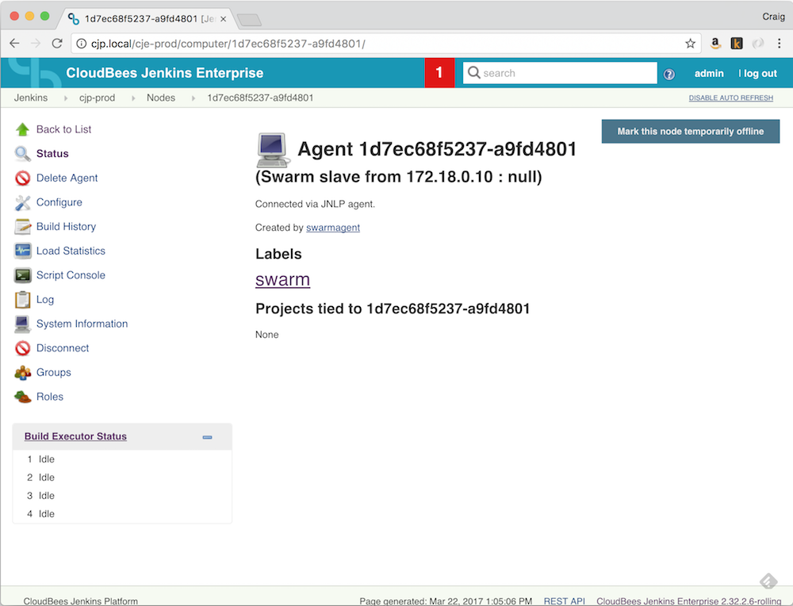

# Jenkins Swarm Agents - Examples

Jenkins Swarm agents are stand alone clients that can auto-discover a Jenkins (http://jenkins.io) master and add resources to the master "auto-magically". This repository is intended to provide examples of how to build Docker based swarm agents. The first example added creates an agent that can [perform Java/Maven builds](#javamaven-agent-example). I will add additional examples in the future as time allows.

**Note**: In order to use swarm agents with Jenkins you need to install the Swarm Plugin (https://wiki.jenkins-ci.org/display/JENKINS/Swarm+Plugin) on your Jenkins masters.

# Java/Maven Agent Example

The Java/Maven agent [Dockerfile.java-swarm-agent](dockerfiles/Dockerfile.java-swarm-agent) creates an Alpine Linux (https://alpinelinux.org/) based docker image with the following components installed on it:

* Java OpenJDK 8
* Maven 3
* Curl
* Git
* The Jenkins Swarm CLI Client

### Jenkins Configuration

In addition to installing the Swarm Plugin (https://wiki.jenkins-ci.org/display/JENKINS/Swarm+Plugin) on your Jenkins masters you need to configure the master to use tools on the agent. The Java home, for example, on the swarm agent is in the /usr/bin/ directory (a standard location for default Java installs on most unix flavors but not where Jenkins installs Java if you do the automatic install). If the master uses a different Java home you will need to add an additional JDK Installation under **Manage Jenkins \ Global Tool Configuration**.

**Note**: In addition to updating the master's Global Tool Configuration you will need to make sure that your jobs are configured to use the tools that are configured on the swarm agent.

### Configuring the Agent

The Java agent example has four configurable settings that you will need to update for your environment. These settings get loaded from the [.env](.env) file when you run the agent from the project's [Makefile](Makefile). The four settings are:

* **SWARM_NETWORK** - Optional, the SWARM_NETWORK setting tells Docker which Docker network the container should connect too when it starts up (see the following documentation for more details: https://docs.docker.com/engine/reference/commandline/network_connect/).

* **SWARM_MASTER** - Optional, the SWARM_MASTER parameter tells the CLI Agent which Jenkins master to connect to (must be specified with full URL, e.g.: http://server:8080/jenkins/). If the parameter isn't set the CLI will attempt to auto-discover a master on the local network.

* **SWARM_USER** - Optional, The Jenkins user name to authenticate with.
* **SWARM_PASS** - Optional, The Jenkins password to authenticate with.

**Note**: The CLI Agent has many additional optional parameters that can be set. Please see the plugin documentation (https://wiki.jenkins-ci.org/display/JENKINS/Swarm+Plugin) for a complete reference. If you choose to add parameters when launching the CLI agent you will need to modify the .env file and the **run-java-agent** section of the Makefile to use the added parameters.


### Building the Agent

Before running the agent you need to create the docker image. Open terminal with the project directory and execute the following command:

```
> make build-java-agent
```

One the build process have completed your image should be viewble using the ```docker images``` command:

```
>docker images
REPOSITORY              TAG                 IMAGE ID            CREATED             SIZE
java-swarm-agent        latest              892ee402bbe4        17 hours ago        218 MB
```

### Running the Agent

Once the docker image has been built you can run it using the following command:

```
> make run-java-agent
```

Which should output something like the following example if successful:

```
docker run -d \
	--network=cjp-demo-environment \
	java-swarm-agent \
	java -jar swarm-client-3.3.jar \
	-master http://cjp.local/cje-prod/ \
	-username swarmagent \
	-password swarmagent
1d7ec68f52377d06676a26ac26c74505f8eea426bddbf8603369eafb159fd745
```

At this point if you have successfully configured your agent to connect to your Jenkins master you should see the new agent appear in the following places within the master:

* On the dash board under Build Executor Status
* On the Manage Nodes screen

The node will have an automatically generated name like: ```1d7ec68f5237-a9fd4801```. If you view the node's status page you should see something like the following screen.



**Note**: The agent has the **swarm** lable attached to it. If you want projects to build on the agent you can use the ```Restrict where this project can be run``` and ```Label Expression``` setting of the build's configuration to tie it to agents with the **swarm** label.

**Super Useful Tidbit**: You can execute the ```make run-java-agent``` to create as many agents as your Docker environment can host. Each time you execute the command a new, unique agent will be created that will independently connect to your Jenkins master (hence the swarm name).

### Stopping the Agent

Once you no longer need the agent you created in the previous section you can stop it using the ```docker stop``` command or by executing the following command from our Makefile:

```
> make stop-java-agents
```

Under the covers this target action runs the following command that stops all of the agents that have been created using the java-swarm-agent docker image:

```
docker stop $(docker ps -q --filter ancestor="java-swarm-agent")
``` 

# License

The content in this repository is Open Source material released under the Apache 2.0 License. Please see the LICENSE file for full license details.

# Disclaimer

The code in this repository is not sponsored or supported by Cloudbees, Inc.
 
# Questions, Feedback, Pull Requests Etc.

If you have any questions, feedback, suggestions, etc. please submit them via issues or, even better, submit a Pull Request!
 
 